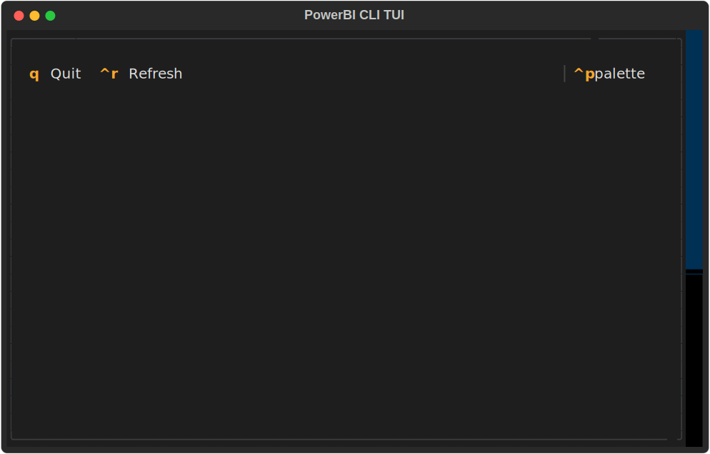

# powerbi-cli

Power BI command line tool with interactive Terminal User Interface (TUI)

## Quick Start

### Interactive TUI Mode

Launch the interactive Terminal User Interface for easy access to all features:

```bash
pbi tui
```



The TUI provides an intuitive interface for:
- Authentication management
- Configuration settings
- Workspaces management
- Apps management
- Reports management
- Users management

See the [TUI documentation](docs/tui.md) for more details.

### Command Line Mode

Use traditional CLI commands:

```bash
pbi --help
```

## Setup

### Requirements

* Python 3.12

### Development

1. Install pre-commit hooks: `pre-commit install`
2. Install dependencies `poetry install`
