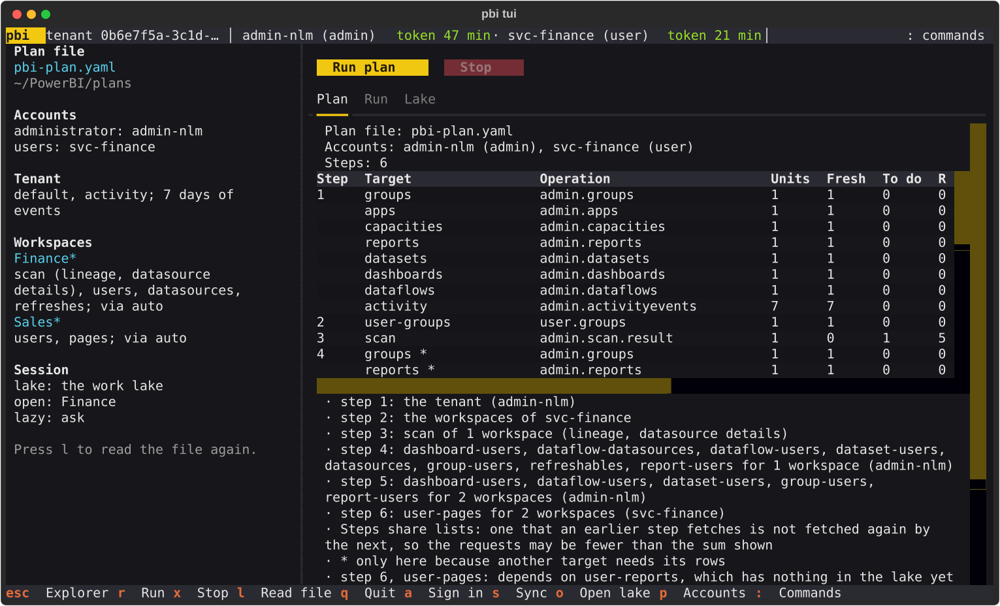

# Plan file

A plan file says **what to keep in the [data lake](lake.md), for which workspaces, and
through which account**, in one small YAML file that `pbi sync` and `pbi tui` both read.

Without it you type target names and options every time (`pbi sync run default activity
scan --lineage --days 7`), the accounts are whichever profiles happen to be active, and
what is wanted for *one workspace* cannot be said at all. With it:

- some workspaces can be read **only through a user account** (a service account that is
  a member of them): say `via: svc-finance` and that account reads them;
- the **details** that cost a request per item (who has access, data sources, pages, how a
  dataset refreshes) are kept for the workspaces you name, not for the whole tenant, so
  they stay within the quotas;
- the file can live anywhere, **a git repository** for example, and the same file drives
  a nightly `pbi sync run` and the terminal UI of whoever opens it.

A plan file never holds a token. It names accounts by the profiles of `pbi auth` (see
[Authentication](auth.md) and `pbi profile list`).

## A first plan

```yaml
--8<-- "examples/pbi-plan.example.yaml"
```

Look at what it would do, and what that costs, before running it:

```bash
pbi sync plan --config pbi-plan.yaml   # reads the lake, calls nothing
pbi sync run  --config pbi-plan.yaml   # does it
```

The file is UTF-8, with or without a byte order mark, or UTF-16, which is what PowerShell
writes by default (`Out-File`, `>`), so a file made there needs no conversion.

The file is **strict**. A key that is not known is an error (with a guess at what you
meant), and so is a key that would do nothing, such as `activity_days` without `activity`
among the targets, or an entry that asks for nothing. Every message names the file, the
line and the key:

```
pbi-plan.yaml:12: workspaces[0].details[1]: 'page' is not a detail. Did you mean 'pages'? The details are: users, datasources, pages, refreshes, parameters, tiles.
```

## The file, section by section

### `version`

Required, and `1`. A pbi that does not know the version of a file says so instead of
guessing.

### `accounts`

```yaml
accounts:
  admin: admin-nlm                 # the administrator's profile
  user: [svc-finance, svc-sales]   # user profiles that may read the workspaces below
```

Both are optional. Without them the **active profile** of each group is used (the active
user profile, if there is one, is the only user account). A profile that is named must have
a token stored, or the plan stops before anything is fetched and says which command stores
one (`pbi auth -t <token> -p svc-sales -g user`).

`user` lists the accounts that `via: auto` and `via: user` choose from, in the order of the
file. A profile named in a `via:` of an entry is used for that entry whether or not it is
listed.

### `tenant`

What to keep for the whole tenant.

```yaml
tenant:
  targets: [default, activity]
  activity_days: 7
```

| Key | What it is |
| --- | --- |
| `targets` | The targets of [`pbi sync`](sync.md#what-can-be-synced). Without it, or with only `tenant:`, it is the plain sync: the lists of the tenant when there is an administrator account, else what a user can see. |
| `activity_days` | Days of audit events, today included, 1 to 28 (default 28). Only with `activity` among the targets. |
| `scan` | **Scan every workspace of the tenant**, with these options: [the scan options](#the-scan-options) below, as a mapping or a list of names; `true` or `[]` is a scan with none. It asks for the scan, so `scan` need not be among the targets as well. (To scan only some workspaces, put `scan:` in an entry of `workspaces` instead.) |
| `full_scan`, `exclude_personal`, `exclude_inactive` | As the options of `pbi sync run` of the same names. They need a scan: a `scan:` section here, or `scan` among the targets. |

The administrator's targets run once, with the administrator's account. A target of a
user's account (`user-groups`, ...) runs **once for each user profile** of the file, each
keeping its own answers in the lake.

### The scan options

A `scan` takes these options (those of the file of [`pbi workspaces scan batch`](scan.md)),
as a mapping in which each is `true` or `false` (`false` is the default), or as a list of the
names of those that are on; the two are the same:

```yaml
scan: {lineage: true, datasource_details: true}
scan: [lineage, datasource_details]
```

| Key | What the scan includes |
| --- | --- |
| `lineage` | Upstream dataflows, tiles and data source ids |
| `datasource_details` | Connection details of the data sources: servers, databases, paths |
| `dataset_schema` | Tables, columns and measures (needs the tenant setting for detailed metadata) |
| `dataset_expressions` | DAX and Power Query expressions (needs the same setting) |
| `get_artifact_users` | The users of reports, dashboards and other items |

### `workspaces`

What to keep for particular workspaces. Each entry says *which* workspaces, and then what to
keep for them: a scan, details, or both.

```yaml
workspaces:
  - name: "Finance*"
    scan: {lineage: true}
    details: [users, datasources, refreshes]
    via: auto
  - id: 3f1c9a52-0000-0000-0000-000000000000
    details: [pages, tiles]
    via: svc-finance
```

**Which workspaces.** An `id`, or a `name`:

- `id`: one workspace, by its id. It is used as it is, even when the lake does not know it.
  A `name` may go with it, as in the file of `pbi workspaces scan batch`: it is then only
  the label that messages call the workspace by, and is not looked up.
- `name`: a pattern for names. `*` stands for any text and `?` for one character, case does
  not matter, and the whole name has to match (`Finance*`, not `Finance`). It is looked up
  in the **list of workspaces in the lake**, so the list has to be there: the steps for the
  tenant fetch it (`default` among `tenant.targets`) before the workspaces are looked up.
  A name matches active workspaces that are not personal; name a personal one by `id`.

**What to keep.**

- `scan`: a metadata scan of these workspaces, with the options above (`true` for none). A
  scan is always read with the administrator's account, whatever `via` says.
- `details`: details of every item in the workspaces (and of the workspace itself), from the
  list below. It costs a request per item, so name only what you need.

| Detail | For | Fetched by an administrator | Fetched by a user |
| --- | --- | --- | --- |
| `users` | workspace | `group-users` | `user-group-users` |
| `users` | report | `report-users` | not possible |
| `users` | dataset | `dataset-users` | `user-dataset-users` (needs Reshare permission) |
| `users` | dashboard | `dashboard-users` | not possible |
| `users` | dataflow | `dataflow-users` | not possible |
| `datasources` | dataset | `datasources` | `user-dataset-datasources` (needs Write permission) |
| `datasources` | dataflow | `dataflow-datasources` | `user-dataflow-datasources` |
| `pages` | report | not possible | `user-pages` |
| `refreshes` | dataset | `refreshables` (a summary of the last week, one request for every dataset) | `user-dataset-refreshes` (needs Write permission; the last 60) |
| `parameters` | dataset | not possible | `user-dataset-parameters` |
| `tiles` | dashboard | not possible | `user-dashboard-tiles` |

**Whose account.** `via` says which account reads the workspaces:

| `via` | The account |
| --- | --- |
| `auto` (the default) | The administrator's, when it can read what is asked (it needs no permission on the item); else a user account whose own list of workspaces holds the workspace. What no stored account can fetch is left out, with a note. |
| `admin` | The administrator's account only. |
| `user` | A user account only, never the administrator's: the first of `accounts.user` whose own list of workspaces holds the workspace. Use it to spare the quota of the administrator's operations. |
| a profile name | That user profile, whatever its list says. |

Which user account lists a workspace comes from the lake: the list of workspaces that each
user account keeps (`user-groups`). When an entry may need it, the plan starts with one
request for each listed user account to fetch that list, so a file works from an empty lake.

What an entry asks of an account that it names is checked: a detail that this kind of
account cannot fetch at all, such as `pages` with `via: admin` (only a user's account has
the operation), is an error that says so. With `via: auto`, which is *whichever account can*,
a detail that no stored account can fetch (`pages` when no user account is stored) is left
out with a note that says what to store, as long as the entry still does something (a scan,
or another detail); an entry that would do nothing is an error. A detail that only *some*
kinds of item can give, such as `users` with `via: user` (a user cannot read the users of a
report), is fetched for those that can, and the plan says which are left out.

### `session`

Settings for [`pbi tui --config`](#in-the-terminal-ui) (a sync ignores them).

```yaml
session:
  lake: ~/PowerBI/shared-lake
  open: "Finance*"
  lazy: ask
```

| Key | What it is |
| --- | --- |
| `lake` | The lake that `pbi tui --config` opens: a folder or a URL such as `s3://bucket/folder`. A relative folder is relative to the folder of the file, and `~` is your home folder. `--lake` and `PBI_LAKE` come first; without any, your work lake (the cache folder). Any lake but your work lake is [opened read-only](sharing.md), and has to exist: leave `lake` out to open your own. A sync never writes there: it writes to your work lake, and says so when this names another. |
| `open` | A workspace to select at the start: an id, or a name pattern (the first match). |
| `lazy` | What to do about a detail the lake lacks: `ask` (press `f`, the default), `auto` (fetch the harmless ones by itself) or `off` (do nothing). Write `off` as it is: it is not read as a yes or a no. |

## How a file becomes runs

A plan is a **sequence of ordinary sync runs**, so the engine, the state of a sync, resuming
and `pbi sync status` are the ones you know. `pbi sync plan --config` shows them:

```
Data lake: /home/me/PowerBI/cache/lake
Plan file: /home/me/plans/pbi-plan.yaml
Accounts: admin-nlm (admin), svc-finance (user), svc-sales (user)

Step 1: the tenant (admin-nlm)
TARGET      OPERATION         UNITS  FRESH  TO DO  REQUESTS
groups      admin.groups      1      0      1      1
apps        admin.apps        1      0      1      1
...
Step 2: the workspaces of svc-finance
TARGET       OPERATION    UNITS  FRESH  TO DO  REQUESTS
user-groups  user.groups  1      0      1      1

Step 3: the workspaces of svc-sales
TARGET       OPERATION    UNITS  FRESH  TO DO  REQUESTS
user-groups  user.groups  1      0      1      1
  workspaces[0] (Finance*): no workspace is called 'Finance*' (the lake holds no list of workspaces yet: the steps for the tenant fetch it)
  Steps share lists: one that an earlier step fetches is not fetched again by the next, so the requests may be fewer than the sum shown

Requests against the quota of each operation
OPERATION         NEEDED  QUOTA         LEFT NOW
admin.groups      1       50/h, 15/min  15
...
Everything fits the quota now.
```

The steps, in order:

1. **The tenant**: one step for the administrator's targets, and one for each user profile
   for the targets of a user's account.
2. **Who lists what**, when an entry may need it: one step per listed user account that
   fetches its list of workspaces (one request each; skipped when it is fresh).
3. **The workspaces**, worked out *after* the steps above from the list of workspaces they
   left in the lake: first the scans (one step for each set of scan options, with all the
   workspaces that want it), then the details: one step for each account and set of targets,
   for the workspaces that need exactly that, the administrator's first and then each user in
   the order of the file.

So **the plan you see before the first run is incomplete**: the names of workspaces cannot be
looked up before the lake has the list, and the plan says so. The same goes for which user
account reads a workspace: until the lake holds the list of workspaces of each user account of
the file, the plan says "which user account lists X is not known yet" and plans nothing that
only a user can read for it. A run fetches those lists first and then knows; if it still says
that no user account lists the workspace (the note then names the accounts), the account has no
access to the workspace: give it access, or name another account with `via:`. Plan again after
a run, or just run: it works out the later steps when it gets there.

What a run does, and what it does not:

- It stops at the first step whose **token expired** (sign in again and run it again: every
  step skips what the lake holds fresh, so it continues where it was), or when it is
  **stopped** (Ctrl-C, or `x` in the terminal UI).
- A name that matches **no workspace** fails the run (the exit code is 1) but the other
  entries are done. The same when a unit fails: it is reported and tried again next time.
- A detail is fetched for the items of the chosen workspaces by reading the **list of items
  of the whole tenant** (one request, skipped while it is fresh) and picking the items whose
  `workspaceId` is in it. A row that does not say its workspace is left out, and the plan and
  the run say so.

## On the command line

```bash
pbi sync plan --config pbi-plan.yaml
pbi sync run  --config pbi-plan.yaml
pbi sync run  --config pbi-plan.yaml --force --workers 8
```

`--config` (`-c`) replaces the target names. These options still apply, to **every step**:
`--force`, `--max-age`, `--workers`, `--wait`, `--scan-interval`, `--scan-timeout`, and
`--days`, which replaces `tenant.activity_days` when you type it. What the file says cannot
be said again, and is refused with a message that says where in the file it goes: target
names, the scan options (`--lineage`, `--datasource-details`, `--dataset-schema`,
`--dataset-expressions`, `--get-artifact-users`), `--full-scan`, `--exclude-personal`,
`--exclude-inactive`, `--admin-profile` and `--user-profile`.

## In the terminal UI

```bash
pbi tui --config pbi-plan.yaml
```



The Sync screen shows the file and the plan of its steps, **Run plan** goes through them, and
`l` reads the file again. When a token expires, the dialog asks for the token of the account
that expired (the kind and the profile), and the plan goes on from the step it was in. The
`session` section chooses the lake, the workspace to select at the start, and whether the
Explorer fetches the details of the item you stay on by itself (`lazy: auto`: only the
harmless ones, and only while quota is left). See [With a plan file](tui.md#with-a-plan-file)
for all of it.

## A nightly job

Keep the file in a repository, and run it from the scheduler of the machine that has the
tokens (see [On a schedule](sync.md#on-a-schedule)), then publish what it made so that
others can read it with no account:

```bash
pbi sync run --config /srv/plans/pbi-plan.yaml --max-age 20h
pbi lake publish s3://my-bucket/pbi-lake --yes
```

Anyone who opens the lake needs no plan file; one that wants `session` settings can have a
file of its own with only a `session` section.
