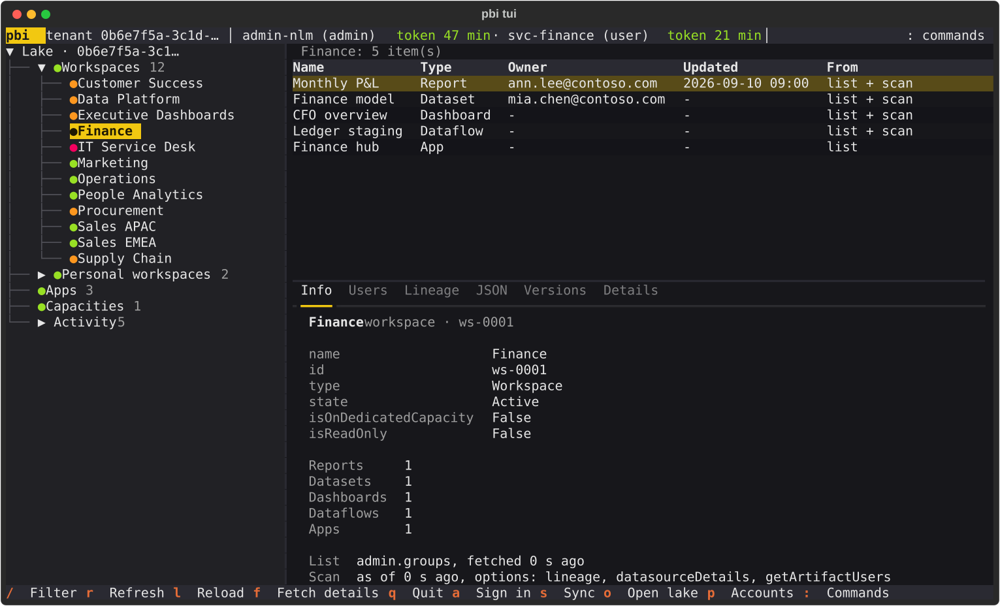
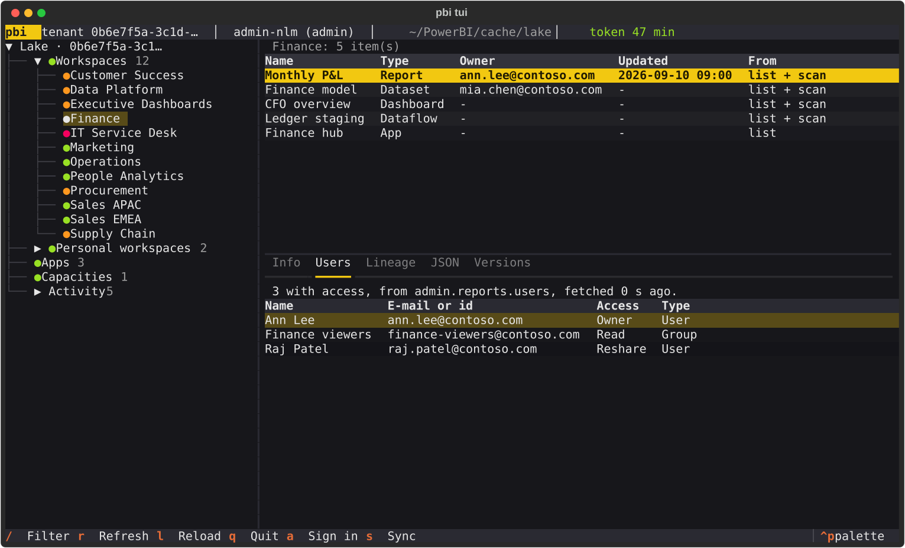
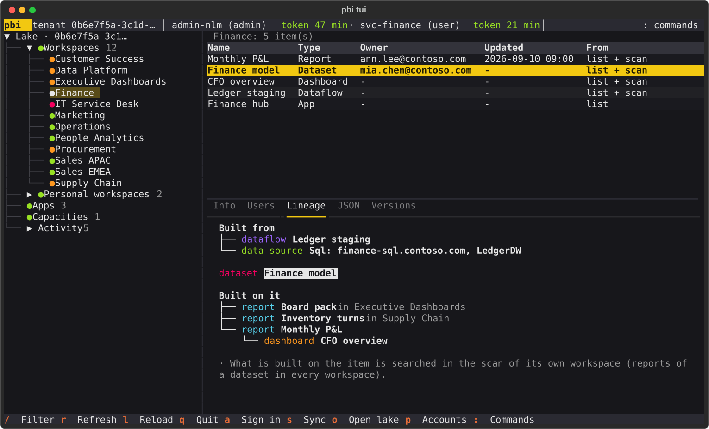
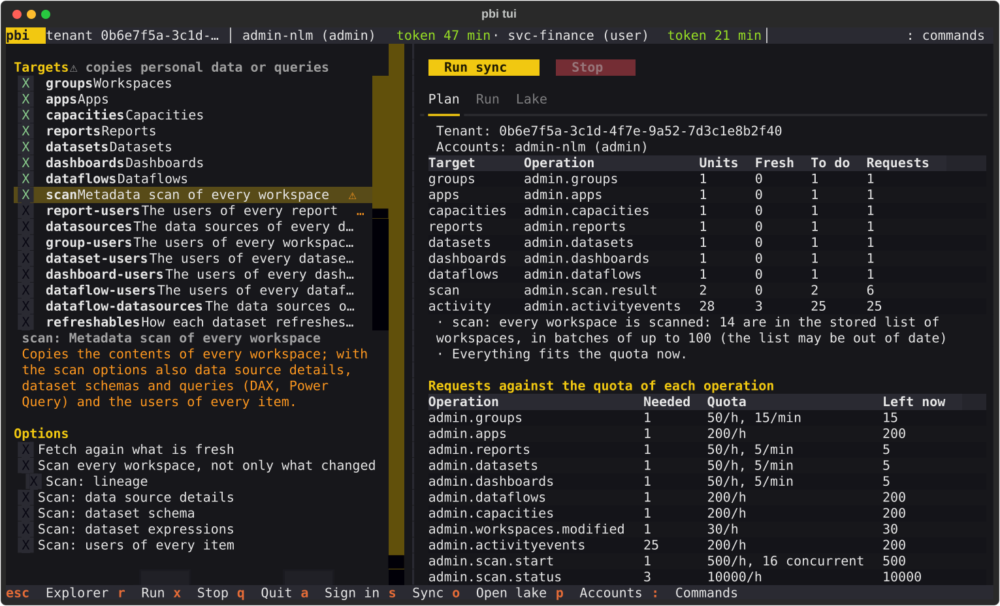
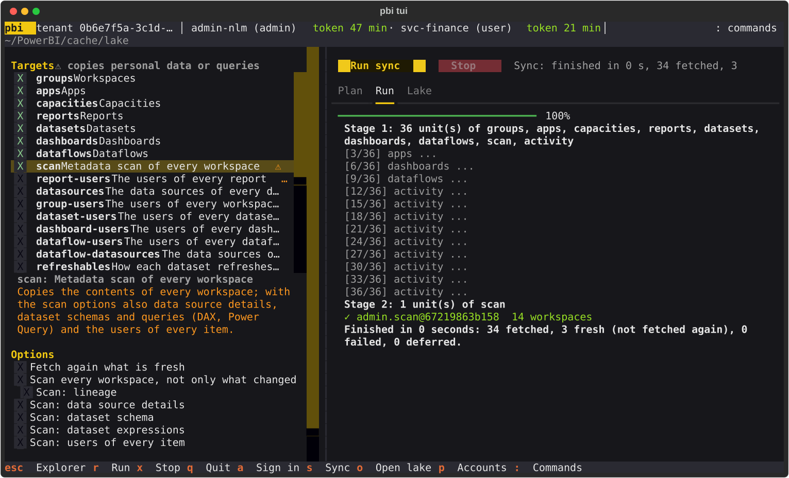
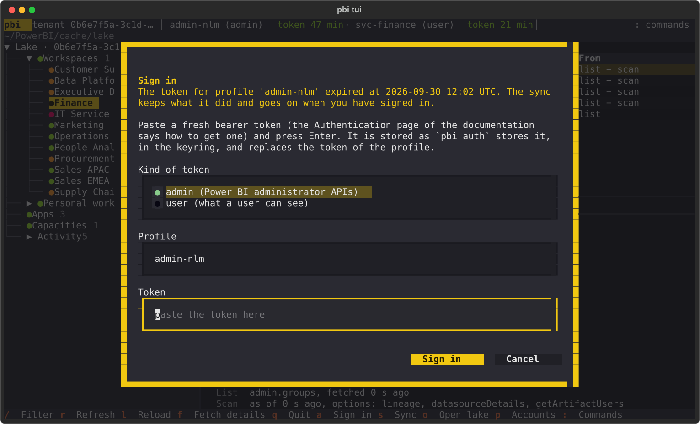
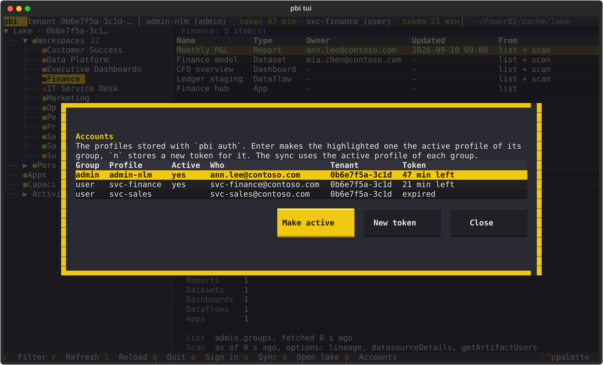
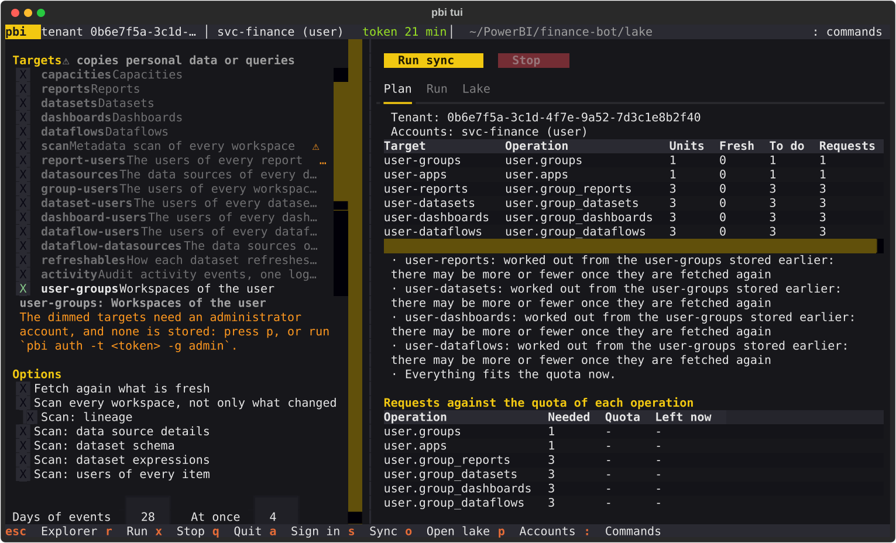
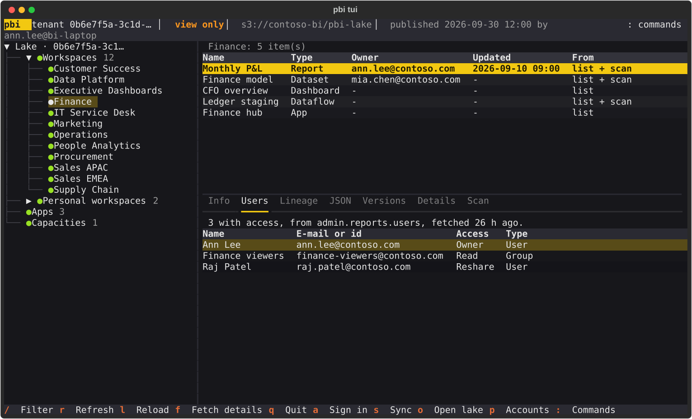

# Terminal UI

`pbi tui` opens a terminal UI for what the [data lake](lake.md) holds. You browse the
workspaces of your tenant, what is in each of them, who can open it, what it is built from
and what is built on it, and how fresh each part is. A second screen plans, runs and stops
a [sync](sync.md). You do not have to remember a command: everything is a key press away.



The UI only reads. Browsing reads the lake on your disk (or in S3), so it works without a
token and without a network. The only requests it ever sends to Power BI are those of
`pbi sync`, which read, and scan, and nothing else.

## Install and start

The UI needs [Textual](https://textual.textualize.io), which is an optional extra:

```bash
pip install "pbi-cli[tui]"          # or, in the repository: uv sync --extra tui
```

It browses the data lake, so set the cache folder once (the lake is its `lake` folder) and
fill the lake with a [sync](sync.md), from the command line or from the UI itself:

```bash
pbi config set-cache-folder ~/PowerBI/cache
pbi sync run default scan --lineage --get-artifact-users   # or press s in the UI
pbi tui
```

A bare `pbi` in a terminal opens the UI too, when Textual is installed and a cache folder is
set; anywhere else it greets as before. `pbi tui --tenant <id>` browses another tenant of
the lake than the one of your token. The log of the UI goes to `~/.pbi_cli/tui.log` (it
would write over the screen otherwise).

## The Explorer

The Explorer has three parts: a tree of the tenant on the left, a table of what is in the
selected node at the top right, and the details of the selected row below it.

### The tree

| Node | What the table lists | Source |
| --- | --- | --- |
| **Lake** (the top) | each list the lake holds, how many rows it has and how fresh it is | the lists of `pbi sync` |
| **Workspaces** | the workspaces; open one to see what is in it | `groups` |
| **Personal workspaces** | the same for personal workspaces (they are many, so they are apart) | `groups` |
| a workspace | its reports, datasets, dashboards, dataflows and apps | the lists, with the newest scan over them |
| **Apps** | the apps of the tenant (with only a user account: the apps of that account) | `apps`, or `user-apps` |
| **Capacities** | the capacities of the tenant | `capacities` |
| **Activity** | the days of audit events in the lake; open a day to see its events, newest first | `activity` |

The dot before a workspace says how fresh what the lake knows about it is. It is the least
fresh of the list of workspaces and the scan of the workspace:

| Dot | Meaning |
| --- | --- |
| green | fresh: younger than the time to live of its target (a day, for the lists and the scans) |
| yellow | older than that, but less than a week |
| red | a week old or more |
| empty grey circle | not in the lake |

An [incremental scan](sync.md#scans) does not fetch a workspace that did not change, so
such a workspace counts as scanned *as of the start of the last complete scan* (with the
same options): an unchanged workspace is not shown as old.

A workspace shows what the lake holds of it, and nothing else. After `pbi sync run groups`,
which fetches only the list of workspaces, every workspace is empty: the title of the table
says that the lists of items are not in the lake, and the Info tab names each list that is
missing (reports, datasets, dashboards, dataflows, apps). Press `s` and **Run** to fetch the
plain targets, or `r` to scan that one workspace. A workspace that really holds nothing says
so, and one that has the lists but was never scanned says to scan it.

### The details

Press a number, or click a tab, to switch the details of the selected row:



| Key | Tab | What it shows |
| --- | --- | --- |
| `1` | Info | the plain fields of the row, where they come from, and how old they are; for a workspace also which accounts see it (*Visible to*, when the lake holds the lists of a user account) |
| `2` | Users | who has access: from the users of the report (`report-users`), from the list of workspaces fetched with `-e users`, or from the scan with `--get-artifact-users`. When the lake does not hold them, the tab says what to fetch |
| `3` | Lineage | what the item is built from and what is built on it (below) |
| `4` | JSON | the stored answer, as it came from the API, and the folder of the lake it is in |
| `5` | Versions | every stored answer that holds this, newest first: when, which operation, how many rows, how big, by which profile |

The **Lineage** tab follows what the scan of the workspace says (it needs a scan with
`--lineage`, and says so when the scan was made without):



- *Built from*: a report's dataset; a dataset's upstream dataflows, datasets and data
  sources; a dashboard's reports and datasets (its tiles). It is followed across
  workspaces, as far as the scans in the lake reach.
- *Built on it*: the reports of a dataset, from the lists of the whole tenant, and
  everything else (datasets on a dataflow, dashboards on a report) from the scan of the
  item's **own** workspace. Another workspace may build on the item without the lake
  knowing; the tab says so.

### Finding things

- `/` filters what has the focus: the workspaces of the tree, or the rows of the table. All
  the words you type must be in the row (case does not matter), so `report` also finds the
  reports of a workspace. `Esc` clears the filter. A table shows at most 2,000 rows and the
  tree 5,000 workspaces; the filter narrows them.
- `Ctrl+P` opens the command palette. Type a name to jump to a workspace, report, dataset,
  dashboard or dataflow, wherever it is; it also lists the commands (Sync, Explorer, Sign
  in, Reload the lake, Choose the tenant).
- `Tab` and `Shift+Tab` move between the tree, the table and the tabs; the arrow keys and
  `Enter` move and open nodes, and the mouse works.

### Reading the lake again, and fetching again

The UI reads the lake when it starts and again after every sync it runs. If something else
syncs while it is open, for example a nightly `pbi sync run`, press `l` to read the lake
again.

`r` fetches again what you have selected, after asking. The dialog shows what will be
requested and how that compares with the quota:

| Selected | What `r` fetches |
| --- | --- |
| a workspace (its node, whatever row of it is selected), or a workspace picked in the list of workspaces | a scan of that one workspace, with the options of its last scan (lineage when it was never scanned): about five requests of the scan quota |
| the Lake, Workspaces or Personal workspaces | the lists of the tenant: workspaces, apps, capacities, reports, datasets, dashboards and dataflows |
| Apps, Capacities | that list |
| Activity | the audit events (a complete day is never fetched again) |

It is the same engine as `pbi sync run`, so the same rules hold: the quotas are kept,
a request waits for a short quota, and what the quota holds back is fetched next time.

With **only a user account** an administrator's scan or tenant list is not possible, so
`r` on a workspace, the Lake or Workspaces fetches *what you can see* instead (the
workspaces of the account, their reports, datasets, dashboards and dataflows, and its
apps), `r` on Apps fetches the apps of the account, and `r` on Capacities or Activity says
that only an administrator account can fetch them. See [Accounts](#accounts).

## The Sync screen

Press `s` to plan and run a sync, and `Esc` (or `e`) to go back to the Explorer.



- **Targets** (left): the same targets as [`pbi sync`](sync.md#what-can-be-synced). The
  plain ones are chosen at first; the ones marked ⚠ copy personal data or queries, and a
  note under the list says what each one copies. Nothing is fetched until you run. A target
  whose account is not stored is dimmed and cannot be chosen, and the note says which account
  it needs (see [Accounts](#accounts)).
- **Options**: fetch again what is fresh (`--force`), scan every workspace, the options of
  the scan, the days of audit events and how many requests go at once.
- **Plan** (right): what the sync would do and what it costs, worked out from what the lake
  holds, with the requests it needs against the quota that is left. It is the plan of
  `pbi sync plan`, updated as you change the targets and the options. Where something does
  not fit the quota now, it says what is held back.
- **Run sync** starts it, and **Stop** ends it. A sync that is stopped finishes the requests
  in flight and starts nothing new, and a request that waits for quota gives up at once.
  What is done is kept: run the sync again and it continues, because what the lake holds
  fresh is not fetched twice. Only one sync runs at a time.



The **Run** tab logs every unit of a small stage and the progress of a big one, with every
failure and every unit that a quota held back, in the words of `pbi sync run`. The
**Lake** tab is `pbi sync status`: what the lake holds for each target, how the last sync
went, the units that failed or were held back, the last complete scan, and the quota left.
A sync goes on while you look at the Explorer: the header shows it, and the Sync screen
shows its log from the start when you open it again.

## Signing in again

The header shows every account you are signed in as (the administrator and the user, as far
as they are stored), and how long each token lasts: green, then yellow in the last ten
minutes, then red when it has expired. Browsing does not need a token, but `pbi sync` does.

When a sync or a refresh finds that a token is missing or has expired, the UI asks for a
new one at once, for the kind of account that is the problem (a sync of `user-...` targets
asks for the user's token, not the administrator's). You can also press `a` at any time.



Paste the token (the field is masked) and press `Enter`. Choose the kind of token, `admin`
or `user`, and the profile; the profile is the active one of the kind, so its token is
replaced (a new profile name stores a new account). The token is stored exactly as
[`pbi auth`](auth.md) stores it, in the keyring. Then the sync that was interrupted starts
again, and continues where it stopped.

## Accounts

You need one account, of either kind (see [Authentication](auth.md#which-accounts-you-need)).
Press `p` for the **Accounts** dialog: the profiles stored with `pbi auth`, both groups, with
who each token is for (read from the token), its tenant, whether it is the active profile of
its group and how long it lasts.



`Enter` (or **Make active**) makes the highlighted profile the active one of its group, the
same as `pbi profile switch`, and the sync uses it from then on. `n` (or **New token**)
opens the sign-in dialog for that profile, which is how an expired token is replaced. A
profile that has no token stored says so.

### Only a user account

Without an administrator account the UI works with what a user can see:

- The Sync screen dims the administrator's targets, says why under the list, and chooses
  the plain targets of a user: the workspaces of the account and their reports, datasets,
  dashboards and dataflows, and the account's apps (`user-groups`, `user-apps`,
  `user-reports`, `user-datasets`, `user-dashboards`, `user-dataflows`). Press **Run sync**
  and the Explorer shows them like the tenant's lists, for the workspaces that account is a
  member of.
- `r` in the Explorer fetches what you can see (see above).
- What needs an administrator (the scan, the users of reports, data sources, audit events,
  capacities) is not offered, and says so.



With both accounts the administrator's lists and scans give the tenant, and the user's lists
add the workspaces that only that account can open, and say who sees what in *Visible to*.
Where both have an item, the administrator's wins.

## Tenants

A lake keeps each tenant apart. The UI shows the tenant of your token; with no token it
shows the only tenant in the lake, or asks which one when there are several. Press `t` to
choose another tenant.

## Other lakes, and view only

The UI shows the lake of your cache folder, your *work lake*, unless you say otherwise.
`pbi tui --lake <folder or s3://bucket/folder>` opens another lake, such as one that a
colleague [published](sharing.md), and so does `o` inside the UI: the dialog lists your work
lake and the lakes you opened lately, or you type a place. If the lake cannot be read, a
message says why and the lake that was open stays open.

A lake opened this way is **read-only**, and the header says **view only** (and, for a
published lake, who published it and when). Nothing can be fetched into it and no account is
needed: the UI does not look up a token, signing in and `r` say that the lake is only looked
at, and **Run** on the Sync screen is off. Everything that only reads works as before: the
tree, the tables, the tabs, the filters, `Ctrl+P` and the Lake tab of the Sync screen. Only
your work lake is ever written by a sync; open it again with `o` to fetch.



## Keys

| Key | Where | What it does |
| --- | --- | --- |
| `q` | everywhere | quit |
| `s` | Explorer | open the Sync screen |
| `Esc`, `e` | Sync | back to the Explorer |
| `a` | everywhere | sign in: store a fresh token |
| `p` | everywhere | the accounts: make a stored profile active, or store a new token for it |
| `t` | everywhere | choose the tenant |
| `o` | everywhere | open another lake (view only), or the work lake again |
| `Ctrl+P` | everywhere | the command palette: jump to a workspace or an item by name |
| `/` | Explorer | filter the tree or the table, whichever has the focus |
| `Esc` | Explorer | clear the filter |
| `r` | Explorer | fetch again what is selected |
| `l` | Explorer | read the lake again |
| `1` to `5` | Explorer | Info, Users, Lineage, JSON, Versions |
| `r` | Sync | run the sync |
| `x` | Sync | stop the sync |
| `1` to `3` | Sync | Plan, Run, Lake |

## Limits

- It shows what the lake holds. A workspace that was never scanned has its name, its
  type and the counts of the lists; each tab says what to sync to get the rest.
- A table shows at most 2,000 rows, the tree 5,000 workspaces and the JSON tab 1,500 lines.
  A filter narrows the tree and the table; the full answer is in the folder of the lake
  that the JSON tab names.
- The lake can be in S3, as for every command, but the UI has only been tried on a local
  folder and on a stand-in for S3 on disk. Reading a lake lists every scan that is stored,
  which takes a while over the network when there are thousands. See
  [Sharing a lake](sharing.md).
- It does not watch the lake: `l` reads it again.

## For developers

The UI is `pbi_cli.tui` (Textual); everything it shows comes from
`pbi_cli.core.catalog`, a read model over the lake that has no terminal in it and can be
used from a script:

```python
from pbi_cli.core.catalog import Catalog
from pbi_cli.core.store import LakeStore

catalog = Catalog(LakeStore("~/PowerBI/cache/lake"), tenant="0b6e7f5a-3c1d-4f7e-9a52-7d3c1e8b2f40")
for item in catalog.items("<workspace id>"):
    print(item.kind, item.name, catalog.users(item).rows)
lineage = catalog.lineage(catalog.item("dataset", "<dataset id>"))
```

The tests drive the real app with Textual's test pilot against the fake Power BI service of
the tests (`tests/test_tui_*.py`). The pictures on this page are made from the real app by
`uv run python scripts/gen_tui_screenshots.py`, on a made-up tenant.
